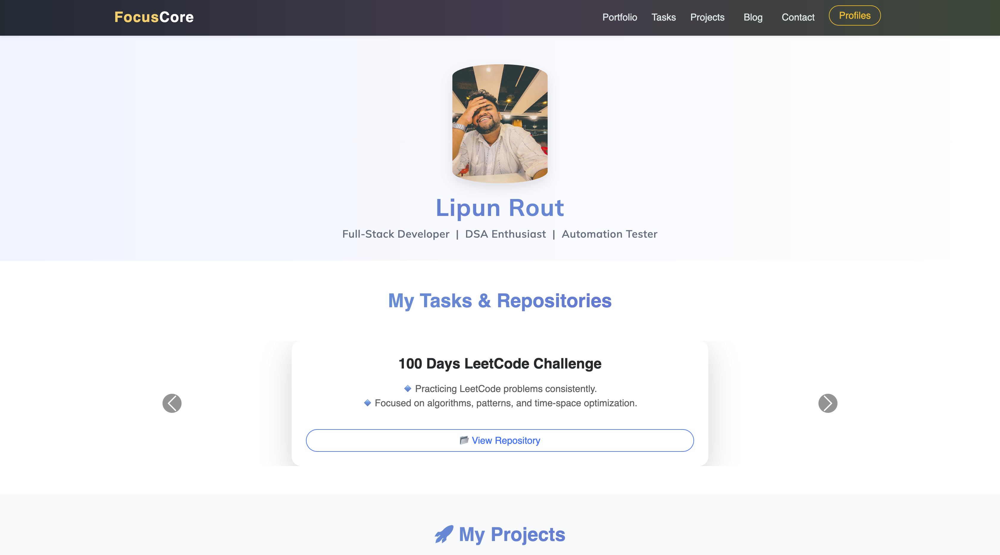

# 🚀 FocusLipun - Developer Portfolio Website

Welcome to **FocusLipun**, a modern, responsive, and aesthetic personal  website built to showcase your skills, projects, daily tasks, blogs, and professional profiles.

---

## 📌 Features

- 🧑‍💻 **About Me** section with animated intro
- 📂 **Projects** section with responsive cards
- 🗒️ **Task List** with GitHub repository links
- 📝 **Blog Section** with animated quotes and tips
- 🌐 **Profiles Page** linking GitHub, LinkedIn, LeetCode, HackerRank, and Naukri
- 📬 **Query Form** powered by Web3Forms (fully styled & validated)
- 📱 Fully responsive (mobile & desktop)
- 🎨 Aesthetic design with modern gradient backgrounds and smooth animations

---

## 📷 Preview

  
*A screenshot of the homepage/hero section.*

---

## 🚀 Tech Stack

- **HTML5**
- **CSS3 / Custom Animations**
- **Bootstrap 5**
- **JavaScript (Basic DOM for interactions)**
- **Web3Forms API** (for contact form)
  
---

## 🔗 Live Demo
--[Click HERE!!!]() 

---

---

Let me know if you'd like a dark mode version, deployment guide (GitHub Pages), or badges (GitHub stars, live site, etc.) added!

